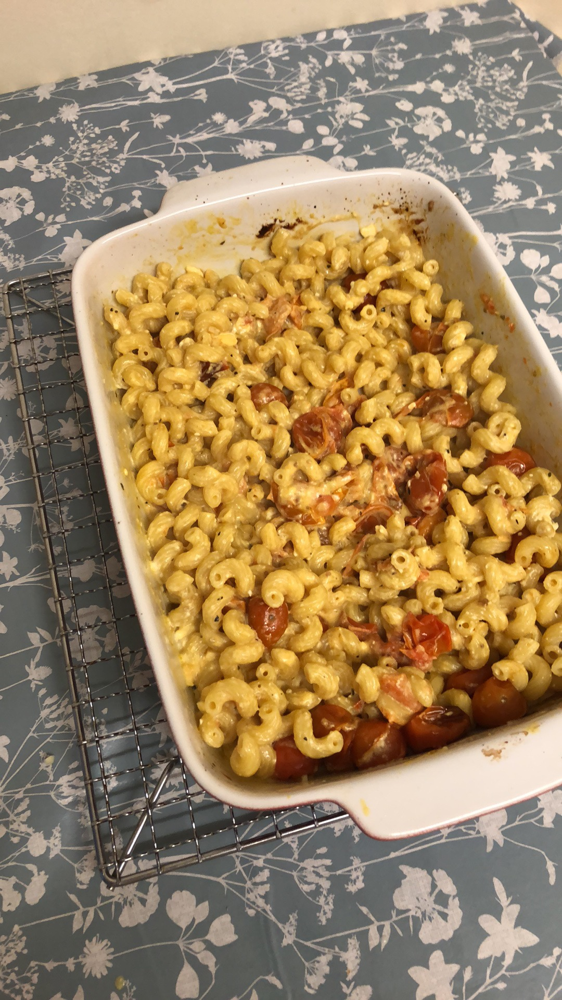

Hi ~ I'm the editor of *tornbetween,* and this weeks theme is 'inspiration'. I will be talking about: Why I chose an Italian inspired blog/eBook? Where my recipes for my eBook are taken from? What books will inspire my internal pages and cover design of my eBook (which will be coming out soon)? Some of my favourite book covers and why I like them and what makes a good book cover? How eBook covers differ from physical printed copies?

1. Why I chose an Italian inspired blog: As I was searching 2021 trends following the events of COVID-19, I saw that expert connoisseurs expect *plant-based foods*, *veganism*, *nutrition-hacking* and *comfort foods* to be what the everyman will be seen to revert towards. The recipes I have chosen are packed full of healthy ingredients, are vegetarian and definitely comforting!  
2. Where my recipes are taken from: Since COVID caused mayhem to our social lives, I gained exponentially more free time, and one app that has worked its way into my everyday life is TikTok. And with TikTok's amazing algorithms a lot of food content has been on my 'for you page'. Users like @alphafoodie, @imp_of_the_perverse and @feelgoodfoodie to name a few. Other recipes are from my family's collection of Italian cookery books and scrap recipes that I found lying around.
3. What books will inspire my internal pages and cover design of my eBook: One of my favourite cookbooks is *The Hungoevr Coobkook*, (spelling intended to mimic the hangover slur); its content is witty and self-deprecating has some genius placements, stunning illustrations and my personal favourite difficulty and time ratings. Which, for a lazy cook like myself is a great idea! Another fantastic cookbook is *Eat. Nourish. Glow,* it's Freer's internal pages that speak volumes and evoke a sensation that the book itself is more like a work of art than a nutritional guidance book. 
4. Some of my favourite book covers and why I like them: Looking at my book collection a lot of my book covers have a person on the cover either full-body or half, illustrated (in the case of fiction or art books) and photography (in the case of cookbooks). My favourites being *Modern Life* (Jean Jullien) and again *Eat. Nourish. Glow,* as it is in my direct sight of vision and looks, in my humble opinion to be the perfect example of a book cover. It seems I am unconsciously drawn to this type of cover, covers that I dislike in comparison are *The Hungry Student Cookbook,* with 50 Shades of Orange.
5. What makes a good book cover: This is relatively simple, as long as you follow some simple rules, a cover won't look terrible even if your imagination is impaired. Typography has to be legible, the quality of the imagery has to be good enough that you can't see a pixel or a blur. The cover needs to be coherent and have some sense of order to it. To make a *good* cover though it needs to be interesting, for example, it should convey some sort of emotion or story and have some sort of identity - so if a person were to look at my recipe eBook cover they need to know immediately that it is a recipe book and not a fantasy fiction book. Colour, imagery, typography should be aesthetically coherent. This is what I intend to convey through my eBook cover.
6. How eBook covers differ from physical printed copies: The margin of sight of an eBook, on say a Kindle, is a lot smaller than a physical normal-sized cookbook so you have to create a cover design that does not lose its identity and legibility, in some shape or form, on a small scale. 

## 'What I have done so far' segment

* Today, I cooked my first recipe '*Feta, Tomato and Basil Spirali*', took a bunch of pictures and will upload the recipe soon. It was delicious, it is definitely worth recreating if you have some time. Here's a photo x

  