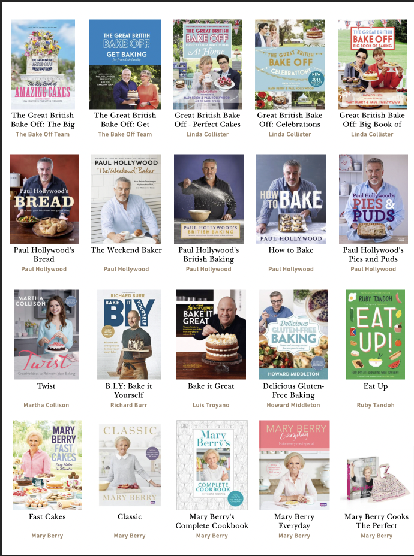

Hi again, *tornbetween* editor here. This weeks theme is HTML and recipe books. What I'll be talking about is: Who invented HTML? What is Markup language? Are recipe books popular? Lastly, where people find their recipes?

~ Who invented HTML? The first version of *Hypertext Markup Language* was written in 1993 by Tim Berners-Lee. In the 2000s, the most widely-used version of HTML was HTML.4.01. The latest version used is HTML5 which was developed by two organisations: W3C and WHATWG.

~ What is Markup Language? It is coding that web browsers like Safari or Chrome use to 'interpret and compose text, images, and other material into visual or audible web pages'. Examples include HTML which inputs text on a web browser and style sheets like CSS (another type of markup language), which 'styles' the HTML to make the text and images look aesthetically pleasing. 

~ Are recipe books popular? Short answer, yes! A longer answer, however, is that recipe books are often on the bestselling charts like The Bookseller's *The Official UK Top 50* Charts. The most successful cases recently being *Pinch of Nom,* which had insane worldwide sales figures and any Ottolenghi cookery book like his recent title, *Simple*. Other recipes books that have great success rates are well-loved figures like Jamie Oliver, Mary Berry, Gordan Ramsey etc. Another trend I have noticed is ex-*Great British Bake Off* figures like Nadia Hussain, Kim Joy, Liam Charles etc. So the USP of *celebrity* is very successful as a selling point of this type of genre of books.

~ Where do people find their recipes? Anywhere from Grandma's hand-written recipe book to TikTok. Recipe content is on any type of media platform, to web browsers and physical hardback books. For my eBook, a couple of my recipes have been sourced from TikTok and others from hardback cookery books that I own.

<https://en.wikipedia.org/wiki/HTML>

## **'What I have done so far' segment**

* I have used Photoshop to create my logo (which is a grocery bag, I'm holding. Red for one colour of the Italian flag). I've also used Photoshop to create my banner image. I've created my eBook cover using again Photoshop, going to the extent of drawing my own vegetable. I've cooked two of my six recipes, and taken photos of these and added them to my Instagram page for this assignment (link is on this website, it is also called tornbetween_). And lastly, I have used Atom to create a HTML and CSS for one of my recipes.

  My eBook design: see below 

  