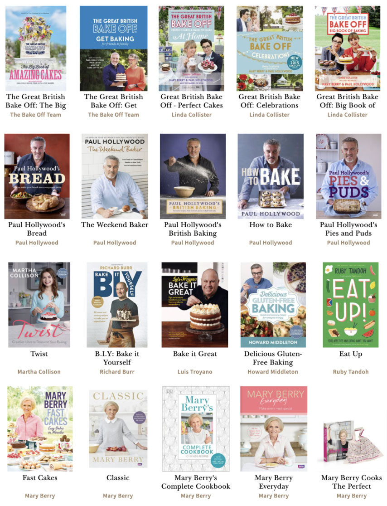
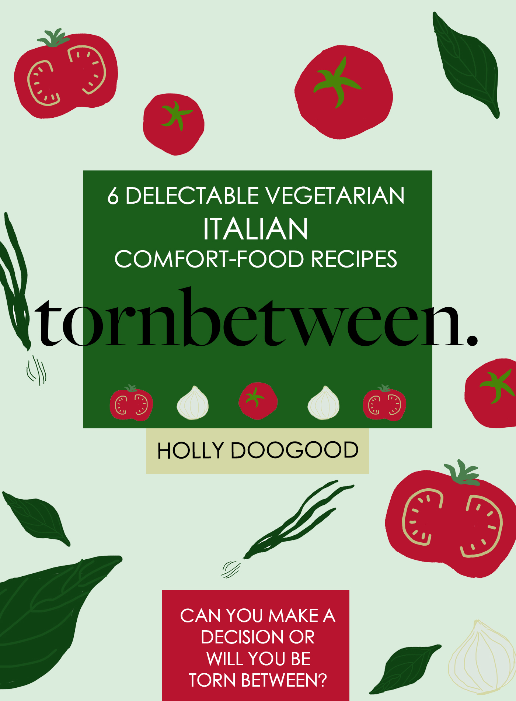

Hi again, *tornbetween* editor here. This weeks theme is 'HTML and recipe books'. What I'll be talking about is: Who invented HTML? What is Markup language? Are recipe books popular? Lastly, where people find their recipes?

1. Who invented HTML: The first version of *Hypertext Markup Language* was written in 1993 by Tim Berners-Lee. In the 2000s, the most widely-used version of HTML was HTML.4.01, however, the latest version used is HTML5. HTML5 was developed by two organisations: W3C and WHATWG. 
2. What is Markup Language: It is coding that web browsers like Safari or Chrome use to 'interpret and compose text, images, and other material into visual or audible web pages'. Examples include HTML which inputs text on a web browser and style sheets like CSS (another type of markup language), which 'styles' the HTML to make the text and images look aesthetically pleasing. For our module, we use an editing software called Atom (where we compose our HTML and CSS), which works alongside GitHub to make this website your own right now possible! If you go onto tornbetween, on the menu bar at the top of the home page, that will take you to my recipe site, which I designed using these Markup languages. It was a little tricky to use at first, however, with a couple of Google searches or help from some lecturers (in my case) it's not too difficult to get your head around once you know the core principles of the language and placements of the code.

Below is a link to the History of HTML is you are interested in expanding your knowledge:

<https://en.wikipedia.org/wiki/HTML>

3. Are recipe books popular: Short answer, yes! A longer answer, however, is that recipe books are often on the bestselling charts like The Bookseller's *The Official UK Top 50* Charts. The most successful cases recently being *Pinch of Nom,* which had insane worldwide sales figures and any Ottolenghi cookery book like his recent title, *Simple*. Other recipes books that have great success rates are well-loved figures like Jamie Oliver, Mary Berry, Gordan Ramsey etc. Another trend I have noticed is ex-*Great British Bake Off* figures like Nadia Hussain, Kim Joy, Liam Charles etc. So the USP of *celebrity* is very successful as a selling point of this type of genre of books. Authenticity or expertise also are compelling USPs to consumers. 

4. Where do people find their recipes: Anywhere from Grandma's hand-written recipe book to TikTok. Recipe content is on any type of media platform, to web browsers and physical hardback books. For my eBook, a couple of my recipes have been sourced from TikTok and others from hardback cookery books that I own. The reason why I choose the recipes I did was simply because I wanted to try them out and expand my culinary repertoire. As a university student, it's sometimes a bit of a shock when you leave the luxuries of your parents/guardian's house and suddenly you have to fend for yourself. Learning how to cook is a vital life skill and to be able to show off your go-to dishes when you have friends or family around and are able to cook them a delicious healthy Italian recipe, I think it's something you can be proud of yourself for! So perhaps, the next time you see a recipe you want to try out, jot it down, take a screenshot etc and try it out, most of the time it isn't as hard as you initially thought it would be (that's what I've learnt by trying out these recipes).

## **'What I have done so far' segment**

* I have used Photoshop to create my logo (which is a grocery bag, I'm holding. Red for one colour of the Italian flag). You can see this at the top-left of my home screen as well as on the tab at the top of your screen. I've also used Photoshop to create my banner image, again to reinforce this is Italian-based cuisine. I've created my eBook cover using again Photoshop, going to the extent of drawing my own array of vegetables. I've cooked two of my six recipes, and taken photos of these and added them to my Instagram page for this assignment (link is on this website, it is also called tornbetween_). And lastly, I have used Atom to create a HTML and CSS for one of my recipes.

  My eBook design: see below 

  