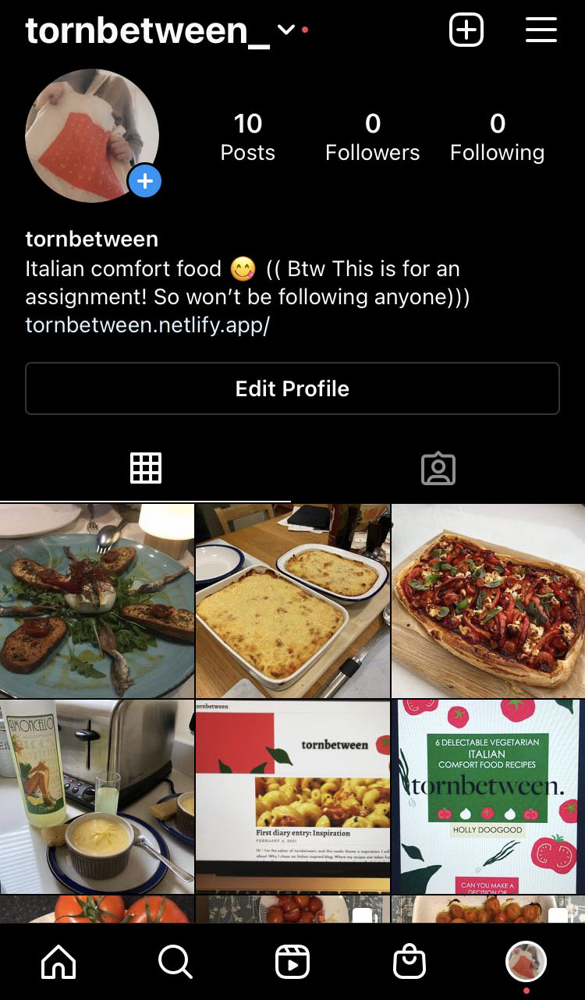

Afternoon tornbetween-ers, today I'll be talking about typefaces. How can we use different typefaces on the web? What are the different categories of typefaces and how are they used? I will also be talking briefly about Markdown and what software it uses? 

1. How can we use different typefaces on the web: If you sign up for Adobe, you are allowed free reign over the thousands of fonts they offer, and many of these fonts have a multitude of variations (sometimes referred to as a *family*). For example, LTC Italian Old Style Pro offers four variants including Italic, Regular, Light Italic and Light. Whereas, Obvia offers 42 typefaces within its font family. Google Fonts also offers free fonts and therefore typefaces to use for your content. 
2. What are the different categories of typefaces and how are they used: Adobe fonts offer 26 categories of tags: *Calligraphic, Clean, Brush Pen, Geometric, Funny, Art Deco, Friendly, Rounded, Cursive, Luxury, Rough, Fun, Futuristic, Marker, Comic, Western, Blackletter, Wedding, School, College, Typewriter, Shaded, Stencil, Inline, Horror and Ornaments*. You use these tags to find the style of font you desire. The categories of typeface that derive from these fonts are often: Regular, Bold and Italic; you're lucky if your desired font has more variants. How you use them, is to download the font or typeface that you desire from the platform i.e. Adobe or Google Fonts and then viola you can use and style them for your project. 

   The nature of the typefaces, however, have different uses. Regular is usually used for your paragraphs (like the once I'm writing here), *Italic* instead is used for *emphasis* or *contrast* of particular words, whereas, **bold** is used to make text **stand out** and is often used for headings or titles.
3. What is Markdown and what software does it use: Markdown is a very simplified lightweight markup language for plain-text editors. On this website here, I can choose between the Rich Text option or Markdown. The Rich Text allows for easy application of options like pressing one button to add an image or make a portion of the text italic. Markdown instead because of its nature of being a markup language uses coding. So, for example, if you want to make a portion of the text the size of my 'What I have done so far' segment' that size and bold, you use three consecutive hashes (###). 
4. LTC Italian Old Style: I used the four variants of this font for my eBook title, compelled mostly by the name of the font, I thought I'd try it out and it seemed to fit nicely with the aesthetic of the cover. I thought I'd go into a bit more history of the font, mostly because I was interested. The Italian Old Style was designed by Frederic Goudy in 1924. Its style is thought to mirror the fashion of Venetian fonts towards the end of the 1600s, however, the LTC version of the font was devised by Lanston Type Company in 2001. 

Link to Google fonts: <https://fonts.google.com/>

Link to the history of Italian Old Style: <http://luc.devroye.org/fonts-89056.html>

## 'What I have done so far' segment

* I have written up my six recipes, each including an image of the food I have made (which I have also uploaded onto my tornbetween_ Instagram account). For each of the recipes,  I wrote an introduction to the different dishes, some with the history of the food. Which were interesting to research, in their own right. I have made progress on my HTML and CSS and will upload the coding to my GitHub in the very near future. I have written up 3 out of my 6 blogs consecutively every Saturday, there may potentially be more. Thanks for reading x

  