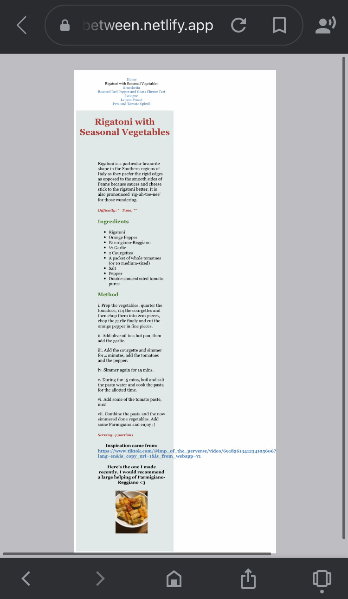
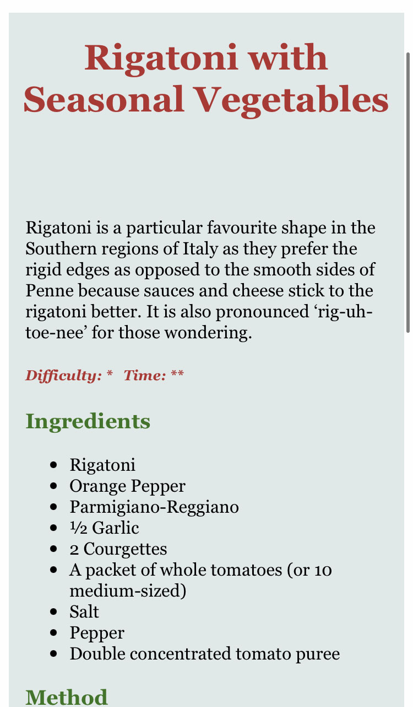

Hi friends, today I'll be focusing on why websites need to be responsive? Why we should test a digital product? And what should you be testing?

1. Why websites need to be responsive: When I was creating the recipe section of my/this website on HTML and CSS, I was using my laptop which has 2560 x 1600 pixels, my phone in comparison is 667 x 375 px. With the variation of screen sizes, my CSS was **only** compatible with my laptop causing my content to appear on my phone in an unsatisfactory manner. See below:

   

As you can see, the text *is* still legible, however, the text could be improved by floating nearer to the margin. Also, another prominent error of my non-responsive text was the link, which did not break like the rest of the text, and caused the margin to be unnaturally pulled to the right to compensate. So in response to this, I tweaked my CSS slightly so that my pages can be styled nicely and can fit different types of window sizes. 

Here's an example of a segment of my CSS that fixed the issue with stretching the text out to fit my phone:


```
  @media screen and (max-width: 700px){
    figure {
      width: 60%;
      float:none;
      margin: 0 auto 2rem auto;
     }
 
 div.content{
 margin: 0 5px 0 5px;
 padding-top: 50px;
 padding-right: 10px;
 padding-bottom: 10px;
 padding-left: 10px;
 max-width: 800px;
}
```

See below the improvements this made to my content's design:



When you add '@media' to a CSS, the content will directly target the different window sizes, in this case, I targeted screens with a max-width of 700px. In my humble opinion, I believe the second image to be a nicer visual for a phone format. What do you think?  

In more severe cases of media queries/issues, text and images will fumble and coincide causing the legibility of the content to be impaired, disrupting the user experience. This obviously needs to be avoided! Further guidance can be found elsewhere like for example [W3Schools](https://www.w3schools.com/) or [CSS-Tricks](https://css-tricks.com/).

2. Why we should test a digital product: Well, like all published content a product needs to be tested. Like, for example, TV shows have Pilot episodes and Video Games have testers to see if the game is easily understandable/playable and has bugs that need to be fixed. Book titles or eBooks (in the case for my upcoming future), have many error-proofing stages, like Proofreading and Copy-Editing, where it is imperative to find continuity errors or simple grammar/spelling errors before the title has gone to its final printing/distributing stages. 
3. So what needs to be tested: Usability, for one; does everything work the way it's intended and does the direction flow. What I mean by this is, you often press different buttons on a webpage, to take you elsewhere on the website. Does that work and can you get back to your previous page or home page with the press of one button? Again, get other people to test whether the information is clear and correct and whether it is compatible with different media screens. 

Sometimes when you build an app or website, the creator personally knows the ins and outs, but is it 'idiot-proof' or perhaps rephrased nicer is it **really easy** to manoeuvre? A good way to test these things is to get some guinea pigs to work their way around the website and offer some *constructive* criticism. 

## **'What I've done so far' segment:**

* So, I have uploaded my working CSS to GitHub and I'm happy with it. It radiates Italian, it's full of colour (I've gotten used to the American spelling of 'color' though, because of the markup language :D) and variation. Hopefully showcasing a bit of knowledge of HTML and CSS now. I've definitely learnt a lot, anyway. I've written 4/6+ blogs and I'm ready to start on my eBook. Thanks - your editor, tornbetween. <3