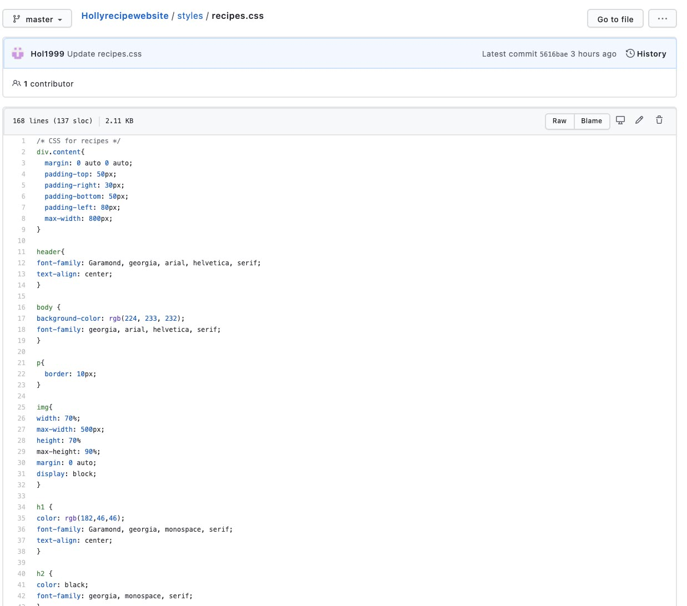

Hi tornbetweeners, it's almost spring. The weather's getting brighter and the flowers are blooming! Anyway back to the focus of todays' blog - eBooks. I'll be talking about what eBooks are...what form can they take and how can we distribute eBooks? 

~ What are eBooks: eBooks are the electronic version of a physical printed book that became popularised in the later years of the 1990s. At the start of its product life cycle, the publishing industry saw it as a **huge** threat that could potentially have been the end of the printed book, but luckily that wasn't the case. I *also* doubt this will happen even in the future, however, some types of media has seen a huge increase in digital sales in comparison to print like Manga and Manwha/Webtoons. Nowadays publishers even release their new titles and lists with an eBook alternative with relatively low expenditure and it is not especially difficult to convert the physical format into eBook format. 

Furthermore, technology has been created to support and enhance the reading experience of eBooks, like that of e-ink readers, *Kindle* and the *Kobo*. I recently saw one of the older versions of the Kindle in my grandparents' house - it was very outdated, and completely drained of colour in its dark grey fashion, and have to say I've quite biased to the physical paperback format. Or even in terms of eBook reading devices like tablets and smartphones with colourful (RGB) interactive illustrations.

~ Anyways, how can we distribute eBooks:

Well, this is done via the internet or in-built apps on smartphones, devices etc. Everyone has their own preference in locating eBooks. For example, my mother has actually during lockdown, started to use her county's public library app and has enjoyed reading this on her smartphone instead of going to the physical library, stating that it's convenient and easily available. Whereas, I consume eBooks when locating material for my university coursework usually via Google Books or specialist webpages that allows institutions to access the material. Moreover, for a couple of years now I have read my international media, i.e. Manga, both in physical format as well as online on legal distribution sites like *Lezhin* and *Tapas*. I personally enjoy the scrollable reading experience these sorts of comics often favour in comparison to digitally turning the page.  

In terms of marketing your eBook for distribution, you should:

1. Promote it on your website (as I have done, see my navigation bar at the top of my home screen: tornbetween).
2. Promote it on different social media i.e. Instagram, Twitter, Facebook (preferably with a lot of hashtags, so it's easier to reach your target market due to the referenced sites impressive algorithms).
3. Reach out to campaigns, influencers, newspapers etc anyone that you would think would be interested in promoting your eBook in exchange maybe for a free copy. 

~ What formats do eBooks take: There are a vast array of different formats, but for our module, we'll be using the widely used ePub3 (which was launched in 2011). ePub3 USPs are said to be due to its reflowable nature and its compatible with lots of different media screens. However, it is uncommon for recipe books, educational books and children's books to favour a reflowable format which novels readers prefer. So, we'll instead be using the fixed format which basically anchors text and images to a certain page number, not allowing for floating. ePub3 fixed offers instead enhancements like videos, animations, audio to be included making the reading experience a little more exciting and interactive.

If you want to read up a bit more on eBooks, I recommend this[ link](<https://learn.g2.com/what-is-an-ebook#:~:text=epub),to%20read%20on%20small%20devices.>)

### 'What I've done so far' segment

* I have made my recipe site live via GitHub! I think it was a fun experience, all in all, learning how to code correctly, how HTML, CSS, Atom, GitHub work and styling a full page of recipes. I think the hardest thing about the coding was how sometimes it felt like trial and error, what goes where...is this the right word to reference in CSS etc but we made it in the end with a *bit* of help. This whole experience has also made me less scared of going out of my comfort zone and cooking meals of different cultures and difficulty. And I'm excited to start the next phase of the module by creating an eBook and now I have prior knowledge about it thanks to my research, I'm less apprehensive! See you next week - tornbetween.  :)

  