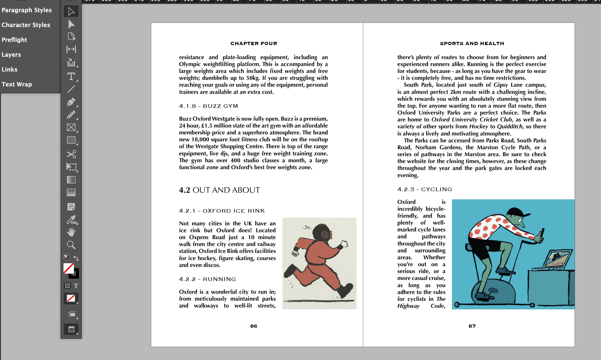
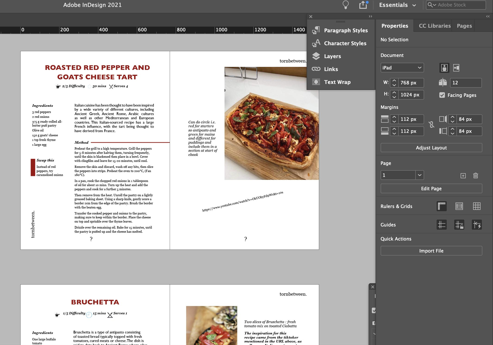

Good afternoon! The topic of my blog today is Adobe InDesign. I'll be talking about how 'style terms' differ in comparison to those used in CSS. What the difference is between paragraph and character styles.

1. How InDesign style terms differ from those used in CSS:

**InDesign style terms vs CSS style terms**

Here's a list of a few style terms I used to style my allrecipe webpage using CSS: *Header, Body, p, img, h1-6, html, padding, position, text-align, @media screen.* The one limitation with CSS is that you kind of feel stuck in the deep end, you need to know style terms before you start. If the coding is done incorrectly, it will show up red but it doesn't state how to fix the issue.

In comparison, for InDesign, all the options are available to you with one touch of a button, you can experiment that much easier and you can basically teach yourself. It has an error box at the bottom of the page with hints on how to fix the problem which I find really useful. The style terms 

1. What is the difference between *paragraph styles* and *character styles*:

**Paragraph styles**

\- Are a set of formatting attributes that apply to a paragraph of your text, e.g. like a header or body text. This would often be the first step of your designing process once you have inserted your text into InDesign. You can then alter the style settings to your preference, changing for example: the colour of the text, the font, the typeface, whether you apply hyphenation, it's justification style, the spacing between each line and the next paragraph etc.

\- If you have to design a large text like a book, it is very quick to apply a paragraph style to the entire document. It is especially beneficial if you decide you want to change the aesthetic of the text, resulting in the new style being automatically applied to the entire text that you applied the paragraph style to (saving a lot of time!).

*In the image below, you can see paragraph styles have been applied to the body text and the headings.*

**Character styles**

\- Instead of a style that applies to an entire paragraph, character styles can pinpoint certain characters within your paragraphs and layer on different attribute features. This can be used in the case of drop caps at the start of your chapters, or if you want one word to be larger than the rest, or a different colour, font etc. 

*In the image above, you can see one character style has been applied to the **4.2** (next to Out and About)*

Links and further references to what I spoke about, including a YouTube video on InDesign paragraph styles and characters styles. And links to CSS and InDesign terms:

<iframe width="560" height="315" src="https://www.youtube.com/embed/pG9JkAPLgs8?rel=0" allow="accelerometer; autoplay; encrypted-media; gyroscope; picture-in-picture" allowfullscreen></iframe>

1. If you're looking for an extensive list of definitions for InDesign terms, click this [link](https://www.paperandoats.com/blog-native/31-adobe-indesign-terms-defined). 
2. If you're instead hoping for a vast list of CSS terms this [link](https://www.impressivewebs.com/css-terms-definitions/) is for you.

### 'What I've done so far' segment

* So since moving on to the last stage of my assignment, I have uploaded my five recipes to InDesign and started designing them in the fashion of an eBook. I'm still in the designing process so there are many technical errors that need fixing in the near future like incorrect colour space, proportion fixing and image resolution.  

  