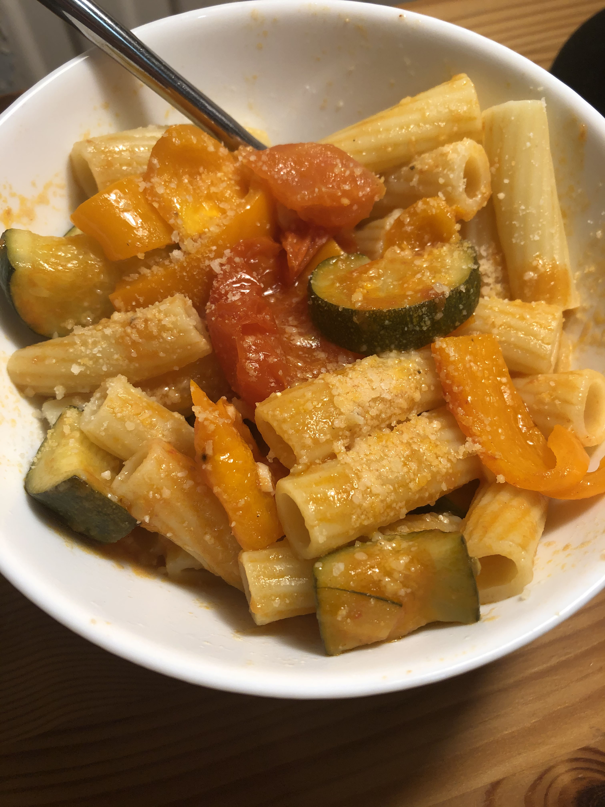

Rigatoni is a particular favourite shape in the Southern regions of Italy as they prefer the rigid edges as opposed to the smooth sides of Penne because sauces and cheese stick to the rigatoni better. It is also pronounced 'rig-uh-toe-nee' for those wondering.

##### Difficulty: \*   Time: \**

### Ingredients

* Rigatoni
* Orange Pepper
* Parmigiano-Reggiano
* ½ Garlic
* 2 Courgettes
* A packet of whole tomatoes (or 10 medium-sized)
* Salt
* Pepper
* Double concentrated tomato puree

### Method

i. Prep the vegetables; quarter the tomatoes, 1/4 the courgettes and then chop them into 2cm pieces, chop the garlic finely and cut the orange pepper in fine pieces.

ii. Add olive oil to a hot pan, then add the garlic.

iii. Add the courgette and simmer for 4 minutes, add the tomatoes and the pepper. 

iv. Simmer again for 15 mins.

v. During the 15 mins, boil and salt the pasta water and cook the pasta for the allotted time.

vi. Add some of the tomato paste, mix!

vii. Combine the pasta and the now simmered done vegetables. Add some Parmigiano and enjoy :)

##### Serving: 4 portions

#### Inspiration came from: <https://www.tiktok.com/@imp_of_the_perverse/video/6918561341234105606?lang=en&is_copy_url=1&is_from_webapp=v1>

#### Here's the one I made recently, I would recommend a large helping of Parmigiano-Reggiano <3

