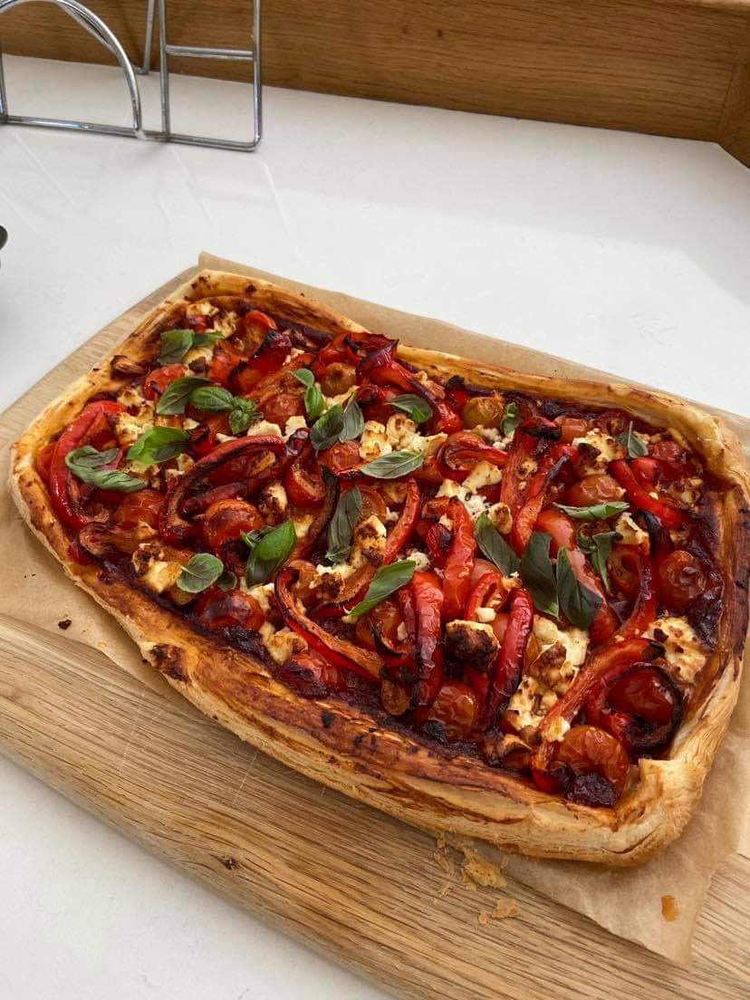

### Difficulty: \*\* Time: \*\**

## Ingredients

* 3 red peppers
* 2 red onions
* 375 g ready-rolled all-butter puff pastry
* Olive oil
* 150 g goats' cheese
* 1 tsp fresh thyme
* 1 large egg

## Method

Preheat the grill to a high temperature. Grill the peppers for 5-8 minutes after halving them, turning frequently, until the skin is blackened then place in a bowl, cover with clingfilm and leave for 15-20 minutes, until cool.

Remove the skin and discard, wash off any bits, then slice the peppers into strips. Preheat the oven to 200°C, (Fan 180°C).

In a pan, cook the chopped red onions in 1 tablespoon of oil for about 10 mins. Turn up the heat and add the peppers and cook for a further 5 minutes. 

Then remove from the heat. Unroll the pastry on a lightly greased baking sheet. Using a sharp knife, gently score a border 2cm from the edge of the pastry. Brush the border with the beaten egg.

Transfer the cooked pepper and onions to the pastry, making sure to keep within the border. Place the cheese on top and sprinkle over the thyme leaves. 

Drizzle over the remaining oil. Bake for 15 minutes, until the pastry is puffed up and the cheese has melted.

### Inspiration came from: 

A Sainsbury's leaflet, my mother and I picked up years ago. 

<https://recipes.sainsburys.co.uk/recipes/main-courses/roasted-red-pepper-tart>

