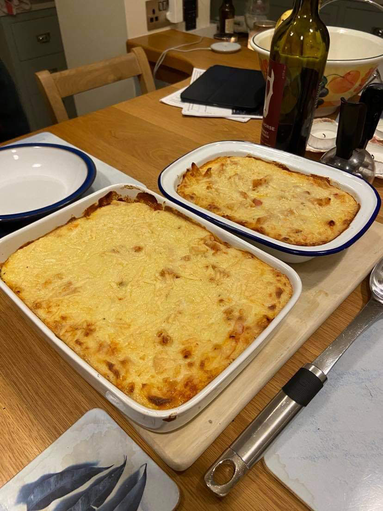

Lasagne is the correct spelling, although it has become more regularly referred to as 'Lasagna' outside of Italy. The Italians usually refer to their pasta dishes in the plural sense because there is more than one piece of pasta in a dish. It is usually eaten as a main dish or a primo and is thought to be one of Italy's oldest dishes, as it is said to have originated in the middle-ages.  

##### Difficulty: \*\* **Time: \*\***

### Ingredients

##### For the meat sauce

* 4 tbsp olive oil
* 1 onion, chopped
* 1 garlic clove 
* 4 rashers of streaky bacon (derinded and chopped)
* 1 diced carrot
* 1 celery stick
* 500g lean minced beef
* 150ml red wine
* 125ml milk
* Grated nutmeg
* 425g chopped tomatoes
* 1 tbsp sugar
* t tsp oregano
* Salt
* Pepper

##### For the Bechamel sauce

* 40g butter
* 40g flour
* 600ml milk
* pinch of ground nutmeg
* black pepper

##### Other ingredients

* 250g dried lasagna sheets
* Freshly made lasagna
* 50g Parmesan cheese
* 15g butter

### Method

i. Make the meat sauce by heating oil in a saucepan, saute the onion, garlic, bacon, carrot, celery until golden. Add the beef and cook until brown, stirring occasionally. Add the red wine and bring to the boil. Reduce the temperature of the hob slightly to medium until the wine has evaporated, then season with salt and pepper. Add the milk and nutmeg, stir until the milk is absorbed. Add the tomatoes, sugar and oregano. Reduce the heat again and let it simmer for 2-3 hours until the sauce is reduced. 

ii. Make the bechamel sauce by melting the butter in a pan, stirring in the flour. Cook over a gentle heat for 2-3 mins, then gradually beating in the milk until the sauce is thick.  Season with nutmeg, salt, pepper and cook for 5-10 mins.

iii. To layer, place a bit of the meat sauce in the baking dish, cover with a sheet of lasagne, add another layer of meat sauce and then add some bechamel sauce, continue layering in this fashion until you run out of ingredients. Finish with a layer of bechamel. 

iv. Sprinkle with some grated parmesan and dollop some butter here and there on top of the last bechamel sauce layer. Place in the oven (preheated) at 230oc (210 Fan) for 30 mins.

Voila!

##### Serving: 6 portions

Inspiration came from: Complete Italian StMichael FROM MARKS & SPENCER Cookbook

