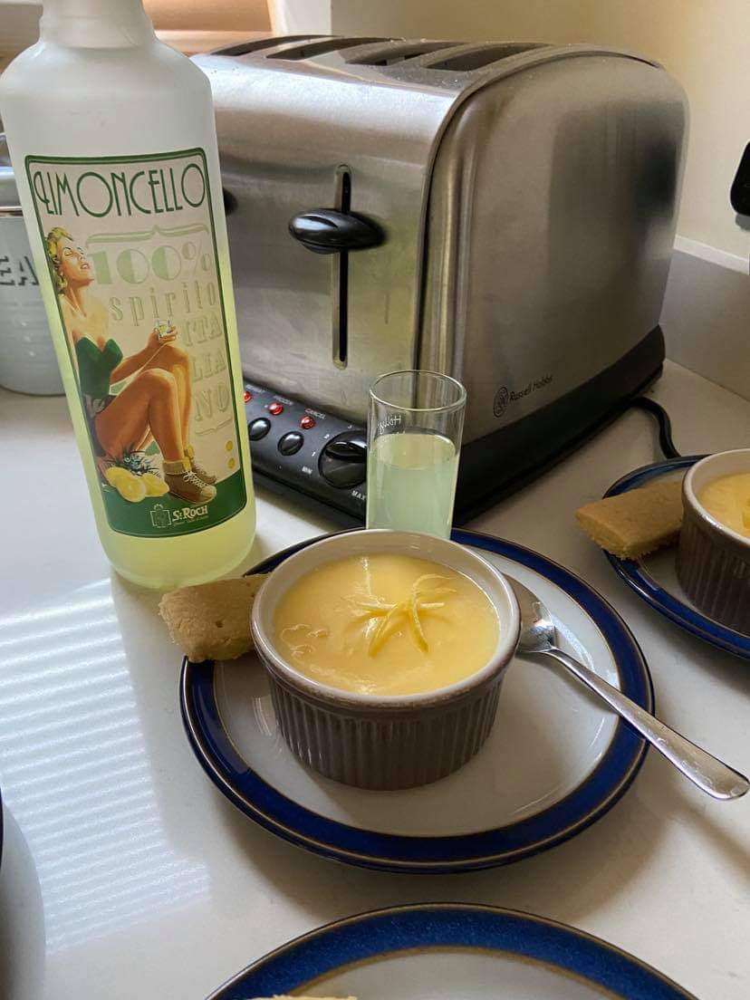

### Difficulty: \*  Time: \**

## Ingredients

* 600ml double heavy cream
* 175g caster sugar
* grated rind and juice of 2 unwaxed lemons

## Method

Pour the cream into a pan. Add the caster sugar and stir until dissolved. Bring to the boil, stirring constantly on medium heat. 

Add almost all of the rind and juice of the lemons, keep a little of the rind for decoration. Stir until the mixture has thickened.

Pour the mixture into heat-proof glasses. Refrigerate till it has set. 

For decoration, sprinkle the leftover rind. 

It is nice served with shortbread and some limoncello.

### Inspiration came from:

BEST-EVER 30-minute Cookbook by Jenni Fleetwood

