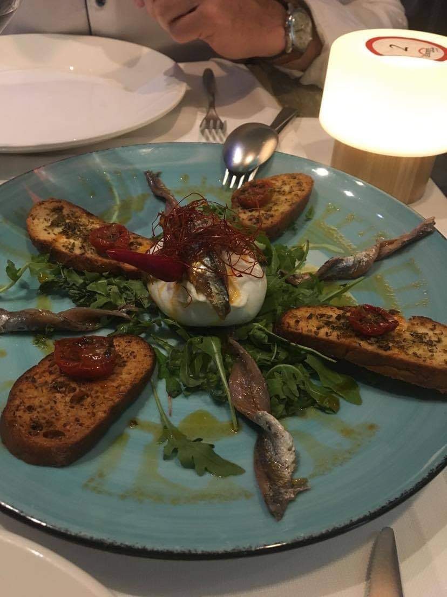

Bruschetta is a type of antipasto consisting of toasted bread typically topped with fresh tomatoes, cured meats or cheese. The dish is said to date back to Ancient Rome where olive growers would bring their harvested olives to taste on some freshly baked bread.

##### Difficulty: \* Time: \*

### Ingredients

* One large buffalo tomato
* Ciabatta
* Basil
* Olive Oil
* Balsamic Vinegar
* Salt
* Pepper
* 1 or 2 cloves of garlic

### Method

i. Chop finely the tomato

ii. Toast the ciabatta in a pan, with some olive oil. Turn on both sides and make sure it's a nice golden colour.

iii. In a bowl, add the tomato, and a drizzle of olive oil and balsamic vinegar with some salt and pepper. Add some finely chopped garlic and stir.

iv. Top the tomato mixture on the ciabatta with some fresh basil or instead eat with a side of rocket, anchovies and a poached egg. 

v. There we go, that's it. Done!

##### Serving: 2 portions

#### The inspiration for this recipe came from the tiktoker mentioned in the URL above, as well as, an Italian restaurant we went to.

The inspiration for this dish came from: [See this site on TikTok](https://www.tiktok.com/@eitan/video/6845019460416376070?lang=en)