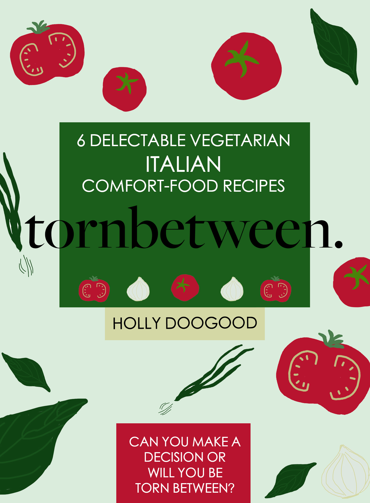

### This is the home page for my recipes.

This eBook contains 6 delicious, effortless Italian recipes with European-Mediterranean influence. Following the 2021 food trends of breakfast, nutrition-hacking and comfort foods, tornbetween features delectable dishes - from Seasonal Vegetable Frittatas, filling Lasagne, two stunning authentic Italian Pasta dishes and more... These recipes transform common ingredients often found in everyone’s pantries, into meals that *all* will love; widening your horizon on the endless potential these ingredients have to offer ~ impressing family and friends alike on your culinary repertoire.

##### See the list of all recipes:

 <https://tornbetween.netlify.app/allrecipes>

### Link to my Instagram page, where I have uploaded the recipes I made:

[https://www.instagram.com/tornbetween_/](https://www.instagram.com/tornbetween_/)